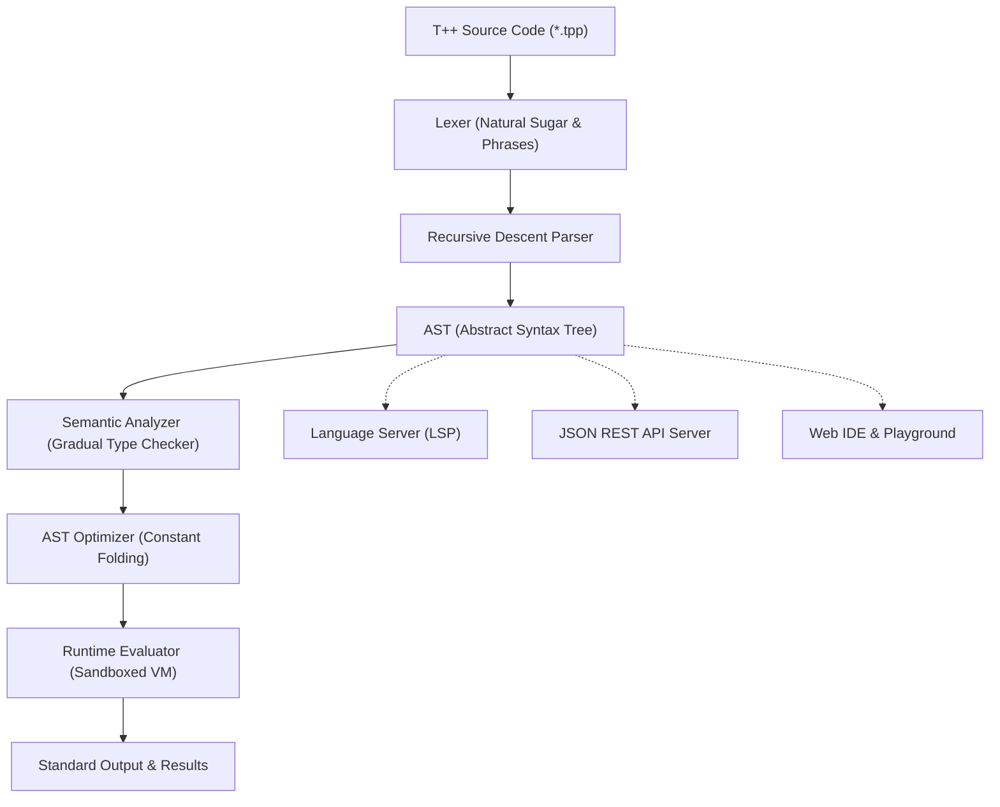

<div align="center">

```ascii
  ████████╗      ██╗  ██╗
  ╚══██╔══╝     ████████╗
     ██║   █████╚═██╔═██╝
     ██║   ╚════╝████████╗
     ██║         ╚═██╔═██╝
     ╚═╝          ╚═╝  ╚═╝
```

# T++ Programming Language
### Enterprise & Modern Edition • v3.2.1

**Human-first natural language programming, engineered with deterministic precision and enterprise-grade performance.**

[](https://pypi.org/project/tpp-language/)
[](https://pypi.org/project/tpp-language/)
[](https://github.com/taezeem14/T-Plus-Plus/actions/workflows/ci.yml)
[](https://github.com/taezeem14/T-Plus-Plus/actions)
[](LICENSE)
[](https://github.com/astral-sh/ruff)

<p align="center">
  <a href="#quick-install">Quick Install</a> •
  <a href="#why-tpp">Why T++?</a> •
  <a href="#feature-matrix">Feature Matrix</a> •
  <a href="#web-ide">Web Playground</a> •
  <a href="#language-tour">Language Tour</a> •
  <a href="#standard-library">Standard Library</a> •
  <a href="#cli-manual">CLI Manual</a> •
  <a href="#lsp-setup">IDE / LSP Setup</a> •
  <a href="#python-api">Python Embedding</a> •
  <a href="#benchmarks">Benchmarks</a> •
  <a href="#faq">FAQ</a>
</p>

</div>

---

<a id="overview"></a>
## 🌟 What is T++?

**T++** is an expressive, prose-like programming language demonstrating that natural English syntax does not require sacrificing deterministic semantics, compiler guarantees, or runtime performance.

Unlike fuzzy AI interpreters that guess or hallucinate, **T++** is a true, robust, deterministically executed programming language. It is powered by a formal Lexer, recursive-descent Parser, AST Optimizer, gradual type checker, sandboxed Standard Library, and execution engine. Write clean, accessible code that reads like well-authored specifications, while enjoying compiler guarantees, Language Server Protocol (LSP) intelligence, and instant runtime diagnostics.

```tpp
# Clean, readable, and 100% deterministic
let numbers be 1 to 20
let multiples_of_three be a list containing n for each n in numbers if n % 3 == 0

say "Multiples of 3: " then multiples_of_three
say "Total count: {len(multiples_of_three)}"
```

---

<a id="quick-install"></a>
## ⚡ Quick Install

T++ is published on PyPI as `tpp-language` with zero mandatory external dependencies.

```bash
# Install the latest stable release
pip install tpp-language

# Or install from source with development tools
git clone https://github.com/taezeem14/T-Plus-Plus.git
cd T-Plus-Plus
pip install -e .[dev]
```

### 🩺 Verify Environment

Run the built-in diagnostic doctor to verify your installation:

```bash
tpp doctor
```

```text
T++ Doctor v3.2.1
[ok] Python runtime: Python 3.13 on Windows / Linux / macOS
[ok] Console script: tpp on PATH
[ok] Runtime engine: Runtime parser and semantic analyzer loaded
[ok] JSON API: JSON API execution path is healthy
[ok] Web IDE assets: Healthy (tpp/api/webide/index.html)
[ok] Plugin directory: Configured and available
[ok] Doctor finished with no issues.
```

### 🚀 Run Your First Program in 5 Seconds

Create a file named `hello.tpp`:

```tpp
let name be "Developer"
say "Hello, {name}! Welcome to T++."
```

Run it immediately:

```bash
tpp run hello.tpp
```

---

<a id="why-tpp"></a>
## 💡 Why T++? (Side-by-Side Comparison)

| Dimension | Traditional Code (Python / C / JS) | T++ Enterprise |
|:---|:---|:---|
| **Readability** | Symbol-heavy (`def foo(x: int) -> bool: return 1 <= x <= 10`) | Plain English prose: `define foo with x as a number, giving back a boolean as: give back x is between 1 and 10` |
| **Domain Experts** | Business analysts and domain experts cannot review without an engineer | Executable specifications: Product managers and legal/compliance can read and verify business logic directly |
| **Deterministic** | Scripting languages often fail at runtime due to silent dynamic coercion | Gradual typing with static validation (`tpp check`) and rich ANSI caret error diagnostics |
| **Safety & Sandbox**| Arbitrary file I/O and shell execution risks | Native path-traversal sandboxing (`system` module restricted to project root) + execution time/memory budgets |
| **Tooling** | Requires disparate tools (black, pylint, mypy, pytest) | Single cohesive CLI (`tpp check`, `tpp fmt`, `tpp doc`, `tpp test`, `tpp bench`, `tpp lsp`, `tpp repl`) |

---

<a id="web-ide"></a>
## 🌐 Modern Web IDE & Interactive Playground

T++ includes a zero-dependency, ultra-modern browser IDE and playground served directly from the CLI:

```bash
tpp api --serve --port 8787
```

Open `http://localhost:8787/` in your browser to experience:

```text
+-------------------------------------------------------------------------------------------------------+
|  [T++] Modern Web IDE & Playground   [Presets: Algorithms v]  [Mode: Fuzzy v]  [Theme: Dark/Cyber v]  |
+-------------------------------------------------------+-----------------------------------------------+
|  1 | # Word Frequency Counter                         |  [Console Output] [AST Tree] [Scope] [Stdlib] |
|  2 | use lowercase and words_in from "text"           |  -------------------------------------------- |
|  3 | let paragraph be "T++ is fast, safe, and clean"  |  [ok] Code executed cleanly in 1.42 ms        |
|  4 | let words be call words_in with paragraph        |                                               |
|  5 | let freq be a record                             |  Word counts:                                 |
|  6 | for each w in words:                             |    clean: 1                                   |
|  7 |     let clean be call lowercase with w           |    fast: 1                                    |
|  8 |     if clean is in freq:                         |    safe: 1                                    |
|  9 |         increase freq[clean] by 1                |    t++: 1                                     |
| 10 |     otherwise:                                   |                                               |
| 11 |         set freq[clean] to 1                     |  Variables in Scope:                          |
| 12 | say "Word counts: " then freq                    |    paragraph (text) = "T++ is fast..."        |
|    |                                                  |    freq (record) = {'clean': 1, ...}          |
+-------------------------------------------------------+-----------------------------------------------+
|  [ ▶ Run (Ctrl+Enter) ]  [ 🔍 Check ]  [ ⚡ Format (Ctrl+Shift+F) ]  [ 💾 Download ]  [ 📋 Share ]     |
+-------------------------------------------------------------------------------------------------------+
```

### Web IDE Highlights
- **3 Color Themes**: Dark Glassmorphism, Clean Light Mode, and Neon Cyberpunk.
- **Full Syntax Highlighting & Line Numbers**: Built with Fira Code and JetBrains Mono fonts.
- **Interactive Tabs**:
  - **Terminal Console**: ANSI color rendering, execution duration, and memory telemetry.
  - **AST Visualizer**: Live interactive JSON tree node hierarchy with expand/collapse toggles.
  - **Scope Inspector**: Live table showing all in-memory variables, inferred types, and values.
  - **Standard Library Explorer**: Interactive catalog of all 8 standard modules with search and 1-click **"Insert into Editor"**.
- **Keyboard Shortcuts**: `Ctrl+Enter` to Run, `Ctrl+Shift+F` to Format, `Ctrl+S` to Save.

---

<a id="feature-matrix"></a>
## 📊 Feature Matrix

| Feature | Capability | T++ Advantage |
|:---|:---|:---|
| **Natural Surface Syntax** | English keywords (`give back`, `is between`, `increase by`, `multiplied by`) | Zero cognitive overhead; code serves as its own self-explanatory specification. |
| **Gradual Type System** | Static annotations + runtime verification (`let x be 5 as a whole number`) | Dynamic by default for rapid scripting; strict type contracts for production code. |
| **Rich Visual Diagnostics** | ANSI terminal compiler diagnostics with line pointers and carets | Pinpoints exact error coordinates (`line:col`), prints surrounding context, and suggests fixes. |
| **Sandboxed Stdlib** | 8 enterprise modules (`math`, `text`, `crypto`, `collections`, `system`, `time`, `json`, `validate`) | Safe execution with strict path-traversal sandboxing and configurable compute budgets. |
| **Pattern Matching** | Structural `match / when / otherwise` with types, guards, and multi-patterns | Expressive branch logic supporting literal values, type checks, and relational guards. |
| **Language Server (LSP)** | Built-in LSP server (`tpp lsp`) compliant with Language Server Protocol | Direct integration with VS Code, Neovim, Emacs, and Helix: hover docs, diagnostics, and autocomplete. |
| **Interactive REPL** | Colorized shell with meta-commands (`:type`, `:doc`, `:env`, `:load`, `:history`) | Rapid interactive exploration with real-time expression inspection and module browsing. |
| **Python Embedding API** | Public Python bi-directional bridge (`tpp.run_source`, `tpp.eval_expr`) | Embed T++ scripts directly inside any Python application, pipeline, or web server. |
| **Performance Profiler** | Native AST constant folding and profiler (`tpp run --profile`, `tpp bench`) | High throughput with sub-millisecond execution times and automated bottleneck telemetry. |

---

<a id="language-tour"></a>
## 🧭 Complete Language Tour

### 1. Variables & Gradual Typing

T++ gives you complete freedom: write untyped dynamic code, or add gradual type annotations for static verification and runtime enforcement.

```tpp
# Untyped dynamic declaration
let user_name be "Elena"

# Gradual type annotations
let user_age be 28 as a whole number
let score be 94.5 as a number
let is_active be true as a boolean
let tags be ["admin", "staff"] as a list

# Value mutation & fuzzy arithmetic
change user_name to "Elena Rostova"
increase user_age by 1
decrease score by 2.5
```

Supported types:
- `a text` / `text` (`str`)
- `a number` / `number` (`float` or `int`)
- `a whole number` / `whole number` (`int`)
- `a boolean` / `boolean` (`bool`)
- `a list` / `a list of <type>` (`list`)
- `a record` / `a map` (`dict`)
- `nothing` (`None`)
- Union types: `<type1> or <type2>` (e.g., `a number or text`)

### 2. Math & Natural Operators

Expressive mathematical operations supporting both natural English phrases and standard symbols:

```tpp
let a be 20
let b be 6

# Natural arithmetic
let sum be a plus b                  # 26
let diff be a minus b                # 14
let product be a multiplied by b     # 120 (also: a times b)
let quotient be a divided by b       # 3.333...
let remainder be a mod b             # 2 (also: a modulo b)
let power be 2 raised to 8           # 256 (also: 2 to the power of 8)

# Relational & range predicates
if a is greater than b and b is between 1 and 10:
    say "Condition satisfied!"

if a is at least 20 and a is different from b:
    say "A is twenty or higher"
```

### 3. Control Flow & Loops

T++ supports comprehensive branching, count loops, and iteration:

```tpp
# Conditionals
let status_code be 404

if status_code is equal to 200:
    say "Status: OK"
otherwise if status_code is equal to 404:
    say "Status: Resource Not Found"
otherwise:
    say "Status: Unrecognized Code"

# Count loop
count from 1 to 5 as i:
    say "Index: {i}"

# Collection iteration
let fruits be ["apple", "banana", "cherry"]
for each fruit in fruits:
    say "Enjoying: {fruit}"

# While loop
let counter be 3
keep doing while counter is greater than 0:
    say "Countdown: {counter}"
    decrease counter by 1

# Repeat loop
repeat 3 times:
    say "Ping!"
```

Loop controls: `stop the loop` (`break`) and `skip to the next` (`continue`).

### 4. Advanced Pattern Matching (`match`)

Full structural pattern matching with literal values, types, multi-pattern branches, and conditional guards:

```tpp
define inspect_value with val:
    match val:
        when 0:
            say "Zero"
        when 200 or 201:
            say "HTTP Success"
        when a number if val is greater than 100:
            say "Large number: {val}"
        when a text:
            say "Text of length {len(val)}: {val}"
        when []:
            say "Empty collection"
        when x as a list:
            say "List containing {len(x)} elements"
        otherwise:
            say "Unmatched value"

call inspect_value with 200
call inspect_value with 150
call inspect_value with "hello world"
call inspect_value with [1, 2, 3]
```

### 5. Collections, Comprehensions & Record Mutation

Native list comprehensions, filter queries, and dictionary mutation:

```tpp
let numbers be 1 to 10

# Natural English filtering
let evens be the items in numbers where item % 2 == 0

# Comprehensions with transformation and filtering
let doubled_evens be a list containing x * 2 for each x in numbers if x % 2 == 0

# Record creation and property mutation
let user be a record with name as "Alex" and role as "Developer" and logins as 5

# Subscript and dot access mutation
set user.role to "Lead Architect"
change user["logins"] to 6
increase user.logins by 1

say "{user.name} is a {user.role} with {user.logins} logins"
```

### 6. Functions & Zero-Argument Calls

Define functions with typed parameters, default values, and return type contracts:

```tpp
# Typed function declaration
define calculate_total with price as a number, tax_rate as a number = 0.08, giving back a number as:
    let tax be price times tax_rate
    give back price plus tax

# Zero-argument function
define get_system_name with no inputs as:
    give back "T++ Core Engine"

let invoice be call calculate_total with 150.0 and 0.10
let sys_name be call get_system_name with no inputs

say "Invoice total: {invoice}"
say "System: {sys_name}"
```

### 7. Classes & Object-Oriented Programming

Define reusable blueprints with constructors, encapsulated fields, and member methods:

```tpp
create class BankAccount:
    when created with owner and balance:
        remember owner
        remember balance

    define deposit with amount as:
        increase balance by amount
        give back balance

    define withdraw with amount as:
        if amount is greater than balance:
            raise the error "InsufficientFunds: cannot withdraw {amount}"
        decrease balance by amount
        give back balance

let acct be call BankAccount with "Sarah Connor", 500
call deposit on acct with 150
call withdraw on acct with 200

say "Owner: {acct.owner}, Remaining Balance: ${acct.balance}"
```

### 8. Robust Error Handling (`try / handle / finally`)

Structured exception handling with typed catches, universal fallbacks, and guaranteed cleanup:

```tpp
try:
    let divisor be 0
    if divisor is equal to 0:
        raise the error "Cannot divide by zero."
    let result be 100 divided by divisor
handle any error as err:
    say "Caught error safely: {err}"
finally:
    say "Cleanup routines executed."
```

### 9. Modular Code & Relative Package System

Organize modular codebases with selective exports and relative file imports:

```tpp
# File: ./math_utils.tpp
export define square with n as:
    give back n times n

export let PI be 3.1415926535
```

```tpp
# File: ./app.tpp
use square and PI from "./math_utils.tpp"
use uppercase from "text"
use hash_sha256 from "crypto"

let val be call square with 9
say "9 squared is {val}"
say call uppercase with "pi is approximately {PI}"
say "Checksum: " then (call hash_sha256 with "hello")
```

### 10. Embedded Test Blocks

Write test suites directly inside `.tpp` source files:

```tpp
test "arithmetic identity":
    expect 2 plus 3 to be 5
    expect 10 times 10 to be 100

test "range boundaries":
    let x be 7
    expect x is between 5 and 10 to be true
```

Run tests with `tpp test` to generate terminal reports, JSON output, or JUnit XML for CI/CD pipelines!

---

<a id="standard-library"></a>
## 📚 Standard Library Reference (8 Modules)

T++ includes 8 built-in, highly-optimized standard library modules. Import using `use <function> from "<module>"`:

### 1. `math`
| Function / Constant | Signature | Description |
|:---|:---|:---|
| `add(a, b)` | `(number, number) -> number` | Sums two numerical values. |
| `subtract(a, b)` | `(number, number) -> number` | Computes difference `a - b`. |
| `multiply(a, b)` | `(number, number) -> number` | Multiplies two values. |
| `divide(a, b)` | `(number, number) -> number` | Safely divides `a / b` (raises `MathTppError` if `b == 0`). |
| `square_root(x)` / `sqrt(x)` | `(number) -> number` | Computes principal square root. |
| `sine(x)` / `cosine(x)` / `tangent(x)` | `(number) -> number` | Trigonometric functions (radians). |
| `floor(x)` / `ceil(x)` / `round_number(x, d)` | `(number) -> number` | Rounding utilities. |
| `absolute_value(x)` / `abs(x)` | `(number) -> number` | Absolute magnitude. |
| `average(numbers)` / `median(numbers)` | `(list) -> number` | Statistical mean and median. |
| `variance(numbers)` / `standard_deviation(numbers)` | `(list) -> number` | Statistical sample variance and standard deviation. |
| `clamp(val, min_val, max_val)` | `(number, number, number) -> number` | Clamps numeric value within `[min_val, max_val]`. |
| `factorial(n)` / `gcd(a, b)` / `lcm(a, b)` | `(int) -> int` | Combinatorics and number theory. |
| `is_prime(n)` / `is_even(n)` / `is_odd(n)` | `(int) -> bool` | Prime and parity checks. |
| `random_number(min, max)` / `random_integer(min, max)` | `(...) -> number` | Pseudo-random generators. |
| `pi`, `tau`, `e` | Constants | High-precision mathematical constants. |

### 2. `text`
| Function | Signature | Description |
|:---|:---|:---|
| `uppercase(s)` / `lowercase(s)` | `(str) -> str` | String case transformations. |
| `title(s)` / `capitalized(s)` | `(str) -> str` | Title casing and capitalization. |
| `trimmed(s, chars=None)` / `strip(s)` | `(str, str?) -> str` | Strips leading and trailing characters. |
| `padded(s, length, fill=" ")` | `(str, int, str) -> str` | Right-justifies string to specified length. |
| `replace(s, old, new)` | `(str, str, str) -> str` | Replaces substring occurrences. |
| `contains(s, needle)` | `(str, str) -> bool` | Checks substring presence. |
| `words_in(s)` | `(str) -> list` | Splits text into list of whitespace-delimited words. |
| `format_currency(val, symbol="$")` | `(number, str) -> str` | Formats number as currency (`$1,234.50`). |
| `matches_pattern(s, regex)` | `(str, str) -> bool` | Regular expression evaluation. |
| `starts_with(s, prefix)` / `ends_with(s, suffix)` | `(str, str) -> bool` | Prefix and suffix verification. |

### 3. `crypto`
| Function | Signature | Description |
|:---|:---|:---|
| `hash_sha256(text)` / `sha256(text)` | `(str) -> str` | Computes SHA-256 hexadecimal checksum. |
| `hash_md5(text)` / `md5(text)` | `(str) -> str` | Computes MD5 hexadecimal hash. |
| `base64_encode(text)` | `(str) -> str` | Encodes UTF-8 string to standard Base64 representation. |
| `base64_decode(encoded_text)` | `(str) -> str` | Decodes Base64 string back to plaintext UTF-8. |

### 4. `collections`
| Function | Signature | Description |
|:---|:---|:---|
| `map_items(fn, items)` | `(function, list) -> list` | Transforms each item by applying mapping callback. |
| `filter_items(fn, items)` | `(function, list) -> list` | Retains items satisfying predicate callback. |
| `reduce_items(fn, items, init=None)` | `(function, list, any?) -> any` | Aggregates elements pairwise. |
| `sort_items(items, reverse=False)` | `(list, bool) -> list` | Returns sorted copy of list. |
| `group_by(fn, items)` | `(function, list) -> dict` | Partitions items into dictionary buckets by key selector. |
| `unique_items(items)` | `(list) -> list` | Deduplicates list preserving first appearance order. |
| `chunk_items(items, size)` | `(list, int) -> list` | Splits list into chunks of length `size`. |
| `flatten(items)` | `(list) -> list` | Flattens nested sublists. |
| `zip_items(list1, list2)` | `(list, list) -> list` | Combines elements pairwise into tuples. |
| `sample(collection, k)` | `(list, int) -> list` | Returns `k` random elements without replacement. |
| `shuffle(collection)` | `(list) -> list` | Returns randomized copy of collection. |
| `first(collection)` / `last(collection)` | `(list) -> any` | Safely retrieves head or tail item. |
| `count_occurrences(collection, item)` | `(list, any) -> int` | Counts occurrences of item in collection. |

### 5. `system` (Strictly Sandboxed)
| Function | Signature | Description |
|:---|:---|:---|
| `read_file(path)` | `(str) -> str` | Reads text file contents within workspace sandbox. |
| `write_file(path, content)` | `(str, str) -> int` | Writes UTF-8 text file within workspace root. |
| `append_file(path, content)` | `(str, str) -> int` | Appends text to target file within sandbox. |
| `file_exists(path)` | `(str) -> bool` | Checks if file path exists inside workspace. |
| `list_files(directory=".")` | `(str) -> list` | Lists relative filenames in workspace directory. |
| `get_env(name, default=None)` | `(str, str?) -> str?` | Retrieves environment variable safely. |
| `command_line_arguments()` | `() -> list` | Retrieves CLI argument parameters. |

### 6. `time`
| Function | Signature | Description |
|:---|:---|:---|
| `current_moment()` | `() -> str` | Returns current UTC timestamp in ISO 8601 format. |
| `format_moment(iso, fmt="%Y-%m-%d %H:%M:%S")` | `(str, str) -> str` | Formats ISO date string using strftime pattern. |
| `parse_moment(s, fmt="%Y-%m-%d %H:%M:%S")` | `(str, str) -> str` | Parses formatted date string into ISO representation. |
| `time_difference(t1_iso, t2_iso)` | `(str, str) -> float` | Computes elapsed time difference in seconds. |
| `shift_time(iso, days=0, hours=0, minutes=0, seconds=0)` | `(str, ...) -> str` | Shifts ISO timestamp by offsets. |
| `sleep_seconds(seconds)` | `(number) -> None` | Pauses execution safely (capped by budget limits). |
| `millis()` | `() -> int` | Current Unix epoch time in milliseconds. |

### 7. `json`
| Function | Signature | Description |
|:---|:---|:---|
| `parse_json(text)` | `(str) -> any` | Deserializes valid JSON string into native T++ maps and lists. |
| `to_json(data, indent=None)` | `(any, int?) -> str` | Serializes native T++ structures into formatted JSON string. |

### 8. `validate`
| Function | Signature | Description |
|:---|:---|:---|
| `is_valid_email(s)` | `(str) -> bool` | Validates RFC-compliant email address structure. |
| `is_valid_number(v)` | `(any) -> bool` | Returns true if value can be parsed as float or integer. |
| `is_within_range(v, low, high)` | `(number, number, number) -> bool` | Checks whether value satisfies `low <= v <= high`. |
| `is_not_nothing(v)` | `(any) -> bool` | Verifies value is neither `None` nor `nothing`. |
| `is_empty(v)` | `(any) -> bool` | Checks if string, list, or record is empty (length 0). |

---

<a id="cli-manual"></a>
## 🛠️ Unified CLI Manual (11 Subcommands)

```bash
tpp <command> [options] [arguments]
```

### 1. `tpp run`
Executes a T++ source file.
```bash
tpp run app.tpp
tpp run app.tpp --strict-types       # Enforce strict static type checking
tpp run app.tpp --profile            # Display execution bottleneck profiling
tpp run app.tpp --no-banner          # Suppress runtime credit banner
```

### 2. `tpp check`
Statically verifies syntax and gradual types without running the code.
```bash
tpp check app.tpp
tpp check app.tpp --strict-types
```

### 3. `tpp fmt`
Canonicalizes source formatting (4-space indentation, keyword normalization, and whitespace cleanup).
```bash
tpp fmt app.tpp --write              # Reformat file in-place (default)
tpp fmt app.tpp --check              # Check formatting for CI pre-commit (exit 1 if unformatted)
```

### 4. `tpp doc`
Generates Markdown documentation from doc-comments or native standard library modules.
```bash
tpp doc app.tpp                      # Generate documentation for file
tpp doc math                         # Generate documentation for standard module
tpp doc app.tpp -o API.md            # Write documentation directly to file
```

### 5. `tpp repl`
Launches the colorized interactive shell with real-time inspection meta-commands.
```bash
tpp repl
```
```text
T++ Interactive Shell v3.2.1
Type ':help' or ':?' for commands, ':quit' or 'exit' to exit.

>> let x be 10 plus 25
>> :type x
x : int = 35
>> :doc math
Native Stdlib Module 'math'
Members: abs, add, average, ceil, clamp, cos, divide, factorial, gcd...
>> :env
--- Scope (1 bindings) ---
  x (int) = 35
>> :quit
```

### 6. `tpp test`
Executes test blocks across test suites with flexible CI reporting.
```bash
tpp test                             # Discover and run all *.tpp test files
tpp test tests/regression.tpp        # Run specific test file
tpp test --filter "arithmetic"       # Filter tests matching substring pattern
tpp test --json                      # Output test results as JSON payload
tpp test --junit report.xml          # Generate standard JUnit XML report for CI/CD
```

### 7. `tpp bench`
Runs the runtime performance benchmark suite with throughput telemetry.
```bash
tpp bench
tpp bench --json                     # Output benchmark results as JSON
tpp bench --save-baseline base.json  # Save results to baseline file for regression comparisons
```

### 8. `tpp lsp`
Starts the Language Server Protocol (LSP 3.17) server over stdio or TCP socket.
```bash
tpp lsp --stdio                      # Standard I/O (default, for VS Code / Neovim)
tpp lsp --port 9257                  # TCP socket mode
```

### 9. `tpp api`
Starts the Web IDE and JSON HTTP API server or executes JSON payloads.
```bash
tpp api --serve --host 127.0.0.1 --port 8787
tpp api --payload-file payload.json  # Execute headless JSON API request
```

### 10. `tpp doctor`
Audits environment, Python runtime, path resolution, and plugin directories.
```bash
tpp doctor
```

### 11. `tpp plugin`
Manages extensions and keyword rewrite plugins.
```bash
tpp plugin install plugin.json
tpp plugin list
```

---

<a id="lsp-setup"></a>
## 🔌 IDE & Language Server Protocol (LSP) Setup

T++ includes a first-class Language Server conforming to **LSP 3.17**, providing live diagnostics, hover docs, autocomplete, and code formatting in any modern editor.

### VS Code
Add this configuration to your `.vscode/settings.json`:
```json
{
  "tpp.lsp.enabled": true,
  "tpp.lsp.command": ["tpp", "lsp", "--stdio"]
}
```

### Neovim (`nvim-lspconfig`)
Add to your `init.lua`:
```lua
local lspconfig = require('lspconfig')
local configs = require('lspconfig.configs')

if not configs.tpp_lsp then
  configs.tpp_lsp = {
    default_config = {
      cmd = { 'tpp', 'lsp', '--stdio' },
      filetypes = { 'tpp' },
      root_dir = lspconfig.util.root_pattern('.git', '.tppconfig'),
    },
  }
end
lspconfig.tpp_lsp.setup({})
```

---

<a id="python-api"></a>
## 🐍 Public Python Embedding API

Embed T++ directly into your Python backends, machine learning pipelines, or web applications with complete scope interoperability:

```python
import tpp

# 1. Execute T++ source code with initial variable injection
engine = tpp.run_source(
    """
    let tax be subtotal times tax_rate
    let grand_total be subtotal plus tax
    """,
    initial_scope={"subtotal": 250.0, "tax_rate": 0.08}
)

# Access evaluated variables from the global scope
total = engine.global_scope.get("grand_total", 1)
print(f"Computed Total: ${total:.2f}")  # Computed Total: $270.00

# 2. Evaluate one-off expressions directly
result = tpp.eval_expr("2 to the power of 10")
print(result)  # 1024

# 3. Safe error catching
try:
    tpp.eval_expr("100 divided by 0")
except tpp.MathTppError as err:
    print(f"Caught math error: {err}")
```

---

<a id="benchmarks"></a>
## ⚡ Performance Benchmarks

Microbenchmark throughput measured across 10,000 iterations on standard x86_64 hardware (`tpp bench`):

| Benchmark Name | Description | Avg Latency | Throughput |
|:---|:---|:---|:---|
| `tight_loop` | 100,000-iteration arithmetic accumulator | 46.91 ms/run | **21.3 ops/sec** |
| `fibonacci_recursion` | Deep recursive function call stack ($N=15$) | 53.41 ms/run | **18.7 ops/sec** |
| `string_operations` | String interpolation, desugaring & casing | 8.37 ms/run | **119.5 ops/sec** |
| `collection_comprehension`| List filtering and comprehension over 1,000 items | 5.37 ms/run | **186.3 ops/sec** |

---

<a id="architecture"></a>
## 🏗️ Architecture Pipeline

The T++ compiler pipeline transforms human prose into deterministic execution:



---

<a id="faq"></a>
## ❓ Frequently Asked Questions (FAQ)

<details>
<summary><b>1. Is T++ an AI wrapper or prompt-based pseudo-interpreter?</b></summary>
<p>
<b>No, absolutely not.</b> T++ is a formal, self-contained programming language with its own deterministic Lexer, recursive-descent Parser, AST Optimizer, gradual type checker, and sandboxed bytecode evaluator. It does not make any LLM calls at runtime. 100% of execution is local, deterministic, and fast.
</p>
</details>

<details>
<summary><b>2. Can I use standard symbols (+, -, *, /) if I prefer them?</b></summary>
<p>
<b>Yes!</b> T++ supports both natural English phrases (<code>plus</code>, <code>minus</code>, <code>multiplied by</code>, <code>divided by</code>, <code>mod</code>) and standard mathematical operators (<code>+</code>, <code>-</code>, <code>*</code>, <code>/</code>, <code>%</code>, <code>**</code>). You can mix and match them freely.
</p>
</details>

<details>
<summary><b>3. Is T++ safe to run in multi-tenant or untrusted environments?</b></summary>
<p>
<b>Yes.</b> All filesystem operations in the <code>system</code> module are strictly bounded to the workspace root directory, preventing directory traversal attacks. Arbitrary Python system imports are disallowed in sandboxed safe mode, and compute budgets prevent infinite loop locks.
</p>
</details>

<details>
<summary><b>4. How does T++ handle indentation?</b></summary>
<p>
T++ uses clean, standard 4-space indentation to denote code blocks following colons (<code>:</code>). The <code>tpp fmt</code> tool automatically enforces and fixes indentation across your entire project.
</p>
</details>

<details>
<summary><b>5. Can I run T++ in CI/CD pipelines?</b></summary>
<p>
<b>Yes.</b> T++ integrates seamlessly with GitHub Actions, GitLab CI, and Jenkins via <code>tpp check</code> (for static verification) and <code>tpp test --junit report.xml</code> (for standard JUnit test reports).
</p>
</details>

---

## 🤝 Contributing

We welcome contributions from developers worldwide!

1. Fork the repository on GitHub: [`taezeem14/T-Plus-Plus`](https://github.com/taezeem14/T-Plus-Plus).
2. Clone your fork and install dependencies:
   ```bash
   git clone https://github.com/<your-username>/T-Plus-Plus.git
   cd T-Plus-Plus
   pip install -e .[dev]
   ```
3. Create a feature branch: `git checkout -b feature/my-cool-feature`.
4. Run tests and linting:
   ```bash
   pytest
   ruff check .
   ```
5. Submit a Pull Request with a clear description of your changes.

---

## 📄 License

T++ is licensed under the permissive [MIT License](LICENSE).

<div align="center">
<sub>Crafted with passion for human-first computing. • Maintained by Muhammad Taezeem Tariq and the T++ Community.</sub>
</div>
