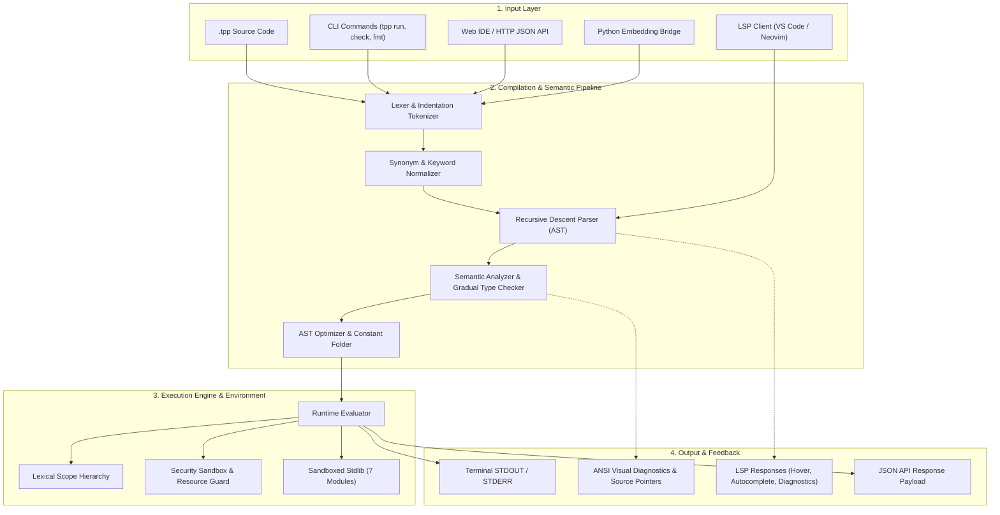

<div align="center">

```ascii
  ████████╗      ██╗  ██╗
  ╚══██╔══╝     ████████╗
     ██║   █████╚═██╔═██╝
     ██║   ╚════╝████████╗
     ██║         ╚═██╔═██╝
     ╚═╝          ╚═╝  ╚═╝
```

# T++ Programming Language
### Enterprise & Modern Edition • v3.2.1

**Human-first natural language programming, engineered with deterministic precision and enterprise-grade performance.**

[](https://pypi.org/project/tpp-language/)
[](https://pypi.org/project/tpp-language/)
[](https://github.com/taezeem14/T-Plus-Plus/actions/workflows/ci.yml)
[](https://github.com/taezeem14/T-Plus-Plus/actions)
[](LICENSE)
[](https://github.com/astral-sh/ruff)

<p align="center">
  <a href="#quick-install">Quick Install</a> •
  <a href="#feature-matrix">Feature Matrix</a> •
  <a href="#language-tour">Language Tour</a> •
  <a href="#standard-library">Standard Library</a> •
  <a href="#cli-manual">CLI Manual</a> •
  <a href="#web-ide">Web IDE</a> •
  <a href="#python-api">Python API</a> •
  <a href="#benchmarks">Benchmarks</a>
</p>

</div>

---

<a id="overview"></a>
## 🌟 Overview

**T++** is an expressive, prose-like programming language demonstrating that natural English syntax does not require sacrificing deterministic semantics, compiler guarantees, or runtime performance.

Unlike fuzzy AI interpreters that hallucinate, **T++** is a true, robust, deterministically executed programming language. It is powered by a formal Lexer, recursive-descent Parser, AST Optimizer, gradual type checker, sandboxed Standard Library, and execution engine. Write clean, accessible code that reads like well-authored specifications, while enjoying compiler guarantees, Language Server Protocol (LSP) intelligence, and instant runtime diagnostics.

```tpp
# Clean, readable, and 100% deterministic
let numbers be 1 to 20
let multiples_of_three be a list containing n for each n in numbers if n % 3 == 0

say "Found multiples: " then multiples_of_three
say "Total count: {len(multiples_of_three)}"
```

---

<a id="quick-install"></a>
## ⚡ Quick Install

T++ is published on PyPI as `tpp-language` with zero mandatory external dependencies.

```bash
# Install the latest stable release
pip install tpp-language

# Or install from source with development tools
git clone https://github.com/taezeem14/T-Plus-Plus.git
cd T-Plus-Plus
pip install -e .[dev]
```

### Verify Environment

Run the built-in diagnostic doctor to verify your installation:

```bash
tpp doctor
```

```text
T++ Doctor v3.2.0
[ok] Python runtime: Python 3.13 on Windows
[ok] Console script: tpp on PATH
[ok] Runtime engine: Runtime parser and semantic analyzer loaded
[ok] JSON API: JSON API execution path is healthy
[ok] Web IDE assets: Healthy
[ok] Plugin directory: Configured and available
[ok] Doctor finished with no issues.
```

### Run Your First Program

Create a file named `hello.tpp`:

```tpp
let greeting be "Hello, World!"
say greeting
```

Run it immediately:

```bash
tpp run hello.tpp
```

---

<a id="feature-matrix"></a>
## 📊 Feature Matrix

| Feature | Capability | T++ 3.2.0 Enterprise Advantage |
|:---|:---|:---|
| **Natural Surface Syntax** | Human-readable English keywords (`give back`, `is between`, `increase by`) | Zero cognitive overhead; code serves as its own self-explanatory specification without cryptic symbols. |
| **Gradual Type System** | Static annotations + runtime verification (`let x be 5 as a whole number`) | Dynamic by default for rapid prototyping, with strict type contracts available when building production code. |
| **Rich Visual Diagnostics** | ANSI terminal compiler diagnostics with line pointers and carets | Pinpoints exact error coordinates (`line:col`), prints surrounding source context, and suggests fixes. |
| **Sandboxed Stdlib** | 7 enterprise modules (`math`, `text`, `collections`, `system`, `time`, `json`, `validate`) | Safe-by-default execution with strict path-traversal sandboxing and configurable compute budgets. |
| **Pattern Matching** | Structural `match / when / otherwise` constructs with relational guards | Expressive branch logic supporting literal values, range intervals, and conditional guards. |
| **Language Server (LSP)** | Built-in LSP server (`tpp lsp`) compliant with Language Server Protocol | Direct integration with VS Code, Neovim, Emacs, and Helix: hover documentation, diagnostics, and autocomplete. |
| **Interactive REPL** | Colorized shell with meta-commands (`:type`, `:doc`, `:env`, `:history`) | Rapid interactive exploration with real-time expression inspection and module browsing. |
| **Web Playground & IDE** | Native HTTP server + zero-dependency browser IDE (`tpp api --serve`) | Instant browser playground with live code editing, execution tracing, AST inspection, and JSON endpoints. |
| **Python Embedding API** | Seamless Python bi-directional bridge (`tpp.run_source`, `tpp.eval_expr`) | Embed T++ scripts directly inside any Python application or pipeline with full scope interoperability. |
| **Performance Profiler** | Native AST constant folding and profiler (`tpp run --profile`) | Sub-millisecond execution times for core workloads and automated bottleneck telemetry. |

---

<a id="language-tour"></a>
## 🧭 Complete Language Tour

### 1. Variables & Gradual Typing

T++ gives you complete freedom: write untyped dynamic code, or add gradual type annotations for static checking and runtime enforcement.

```tpp
# Untyped dynamic declaration
let user_name be "Elena"

# Gradual type annotation
let user_age be 28 as a whole number
let score be 94.5 as a number
let is_active be true as a boolean
let tags be ["admin", "staff"] as a list

# Value mutation & fuzzy modification
change user_name to "Elena Rostova"
increase user_age by 1
decrease score by 2.5
```

Supported primitive and container types:
- `a text` / `text` (`str`)
- `a number` / `number` (`float` or `int`)
- `a whole number` / `whole number` (`int`)
- `a boolean` / `boolean` (`bool`)
- `a list` / `a list of <type>` (`list`)
- `a record` / `a map` (`dict`)
- `nothing` (`None`)
- Union types: `<type1> or <type2>` (e.g., `a number or text`)

### 2. Math & Relational Operators

Expressive mathematical operations with both natural prose and familiar operators:

```tpp
let a be 20
let b be 6

# Arithmetic expressions
let sum be a plus b                  # 26
let diff be a minus b                # 14
let product be a times b             # 120
let quotient be a divided by b       # 3.333...
let remainder be a modulo b          # 2
let power be 2 to the power of 8     # 256

# Relational & logical predicates
if a is greater than b and b is between 1 and 10:
    say "Condition satisfied!"

if a is at least 20 and a is not equal to b:
    say "A is twenty or higher"
```

### 3. Control Flow & Loops

T++ supports comprehensive branching and iteration structures:

```tpp
# Conditionals
let status_code be 404

if status_code is equal to 200:
    say "Status: OK"
otherwise if status_code is equal to 404:
    say "Status: Resource Not Found"
otherwise:
    say "Status: Unrecognized Code"

# Count loop
count from 1 to 5 as i:
    say "Index: {i}"

# Iteration loop
let fruits be ["apple", "banana", "cherry"]
for each fruit in fruits:
    say "Enjoying: {fruit}"

# While loop
let counter be 3
keep doing while counter is greater than 0:
    say "Countdown: {counter}"
    decrease counter by 1

# Repeat loops
repeat 3 times:
    say "Ping!"
```

Loop controls: `stop the loop` (`break`) and `skip to the next` (`continue`).

### 4. First-Class Pattern Matching

Structural pattern matching with conditional expression guards:

```tpp
define handle_status with code:
    match code:
        when 200:
            say "200 OK: Operation completed successfully."
        when 404:
            say "404 Not Found: Requested resource does not exist."
        when 500:
            say "500 Internal Error: Server failure detected."
        otherwise:
            say "Unknown status code: {code}"

call handle_status with 200
call handle_status with 404
call handle_status with 500
```

### 5. Collections & Comprehensions

Native list comprehensions and filter queries make data transformation expressive and concise:

```tpp
# List declaration
let numbers be a list containing 1 and 2 and 3 and 4 and 5 and 6 and 7 and 8 and 9 and 10

# Natural English filtering
let evens be the items in numbers where item % 2 == 0

# List comprehension with transformation and filtering
let doubled be a list containing x times 2 for each x in numbers if x > 4

# Records and Key-Value Maps
let student be a record with name as "Alex" and course as "Computer Science" and gpa as 3.9

say "Student name: " then student.name
say "Student GPA: " then student.gpa
```

### 6. Functions & Methods

Define functions with optional parameter types, default arguments, and return type contracts:

```tpp
# Typed function declaration
define calculate_discount with price as a number, rate as a number = 0.15, giving back a number as:
    let discount be price times rate
    give back price minus discount

# Invocation syntax
let final_price be call calculate_discount with 120.0 and 0.20
say "Discounted total: {final_price}"
```

### 7. Classes & Object-Oriented Programming

Define reusable blueprints with constructors, encapsulated fields, and member methods:

```tpp
create class BankAccount:
    when created with owner and balance:
        remember owner
        remember balance

    define deposit with amount:
        increase balance by amount
        give back balance

    define withdraw with amount:
        decrease balance by amount
        give back balance

let acct be call BankAccount with "Sarah Connor", 100
call deposit on acct with 75
call withdraw on acct with 50

say "Owner: " then acct.owner
say "Balance: " then acct.balance
```

### 8. Robust Error Handling

Structured exception handling with typed catches, universal fallback, and guarantee blocks:

```tpp
try:
    let divisor be 0
    if divisor is equal to 0:
        raise the error "DivisionByZero: Cannot divide by zero."
    let result be 100 divided by divisor
handle any error as general_err:
    say "Encountered unexpected error: {general_err}"
finally:
    say "Cleanup routines finalized."
```

### 9. Module System & Exports

Organize modular codebases cleanly with selective exports and imports:

```tpp
# File: math_helpers.tpp
export define factorial with n as:
    if n is less than or equal to 1:
        give back 1
    give back n times (call factorial with n minus 1)

export let GOLDEN_RATIO be 1.6180339887
```

```tpp
# File: main.tpp
use factorial and GOLDEN_RATIO from "./math_helpers.tpp"
use uppercase from "text"

let fact5 be call factorial with 5
say "5! = {fact5}"
say call uppercase with "golden ratio is {GOLDEN_RATIO}"
```

---

<a id="standard-library"></a>
## 📚 Standard Library Reference

T++ 3.2.0 includes 7 built-in, highly-optimized standard library modules. All modules are imported using `use <function> from "<module>"` or `use the "<module>" module`.

### 1. `math`
| Function / Constant | Signature | Description |
|:---|:---|:---|
| `add(a, b)` | `(number, number) -> number` | Sums two numerical values. |
| `subtract(a, b)` | `(number, number) -> number` | Computes difference `a - b`. |
| `multiply(a, b)` | `(number, number) -> number` | Multiplies two values. |
| `divide(a, b)` | `(number, number) -> number` | Safely divides `a / b` (raises `MathTppError` if `b == 0`). |
| `square_root(x)` / `sqrt(x)` | `(number) -> number` | Computes principal square root. |
| `sine(x)` / `sin(x)` | `(number) -> number` | Trigonometric sine (radians). |
| `cosine(x)` / `cos(x)` | `(number) -> number` | Trigonometric cosine (radians). |
| `tangent(x)` / `tan(x)` | `(number) -> number` | Trigonometric tangent (radians). |
| `floor(x)` / `round_down(x)` | `(number) -> int` | Rounds downward to nearest integer. |
| `ceil(x)` / `round_up(x)` | `(number) -> int` | Rounds upward to nearest integer. |
| `round_number(x, digits=0)` | `(number, int) -> number` | Rounds to specified decimal precision. |
| `absolute_value(x)` / `abs(x)` | `(number) -> number` | Computes absolute magnitude. |
| `average(numbers)` | `(list) -> number` | Calculates arithmetic mean of a collection. |
| `median(numbers)` | `(list) -> number` | Computes statistical median of numbers. |
| `is_prime(n)` | `(int) -> bool` | Checks if integer is prime. |
| `is_even(n)` / `is_odd(n)` | `(int) -> bool` | Checks parity. |
| `random_number(min=0, max=1)`| `(number, number) -> float` | Generates uniform random float in `[min, max)`. |
| `random_integer(min, max)` | `(int, int) -> int` | Generates pseudo-random integer in `[min, max]`. |
| `pi`, `tau`, `e` | Constants | High-precision mathematical constants. |

### 2. `text`
| Function | Signature | Description |
|:---|:---|:---|
| `uppercase(s)` | `(str) -> str` | Converts string to uppercase. |
| `lowercase(s)` | `(str) -> str` | Converts string to lowercase. |
| `title(s)` | `(str) -> str` | Converts text to Title Case. |
| `capitalized(s)` | `(str) -> str` | Capitalizes leading character. |
| `trimmed(s, chars=None)` / `strip(s)` | `(str, str?) -> str` | Strips leading and trailing whitespace or target characters. |
| `padded(s, length, fill=" ")` | `(str, int, str) -> str` | Right-justifies string to target length. |
| `replace(s, old, new)` | `(str, str, str) -> str` | Replaces occurrences of substring `old` with `new`. |
| `contains(s, needle)` | `(str, str) -> bool` | Checks if substring exists in text. |
| `words_in(s)` | `(str) -> list` | Splits text into list of whitespace-delimited words. |
| `format_currency(val, symbol="$")` | `(number, str) -> str` | Formats number as two-decimal currency string (`$1,234.50`). |
| `matches_pattern(s, regex)` | `(str, str) -> bool` | Evaluates regular expression match. |
| `starts_with(s, prefix)` / `ends_with(s, suffix)` | `(str, str) -> bool` | Checks string prefix or suffix. |

### 3. `collections`
| Function | Signature | Description |
|:---|:---|:---|
| `map_items(fn, items)` | `(function, list) -> list` | Transforms each item by applying mapping callback. |
| `filter_items(fn, items)` | `(function, list) -> list` | Retains items satisfying predicate callback. |
| `reduce_items(fn, items, init=None)` | `(function, list, any?) -> any` | Aggregates elements pairwise into single accumulated value. |
| `sort_items(items, reverse=False)` | `(list, bool) -> list` | Returns sorted copy of list. |
| `group_by(fn, items)` | `(function, list) -> dict` | Partitions items into dictionary buckets by key selector. |
| `unique_items(items)` | `(list) -> list` | Deduplicates list while preserving first appearance order. |
| `chunk_items(items, size)` | `(list, int) -> list` | Splits list into sublists of length `size`. |
| `flatten(items)` | `(list) -> list` | Flattens one nested layer of sublists. |
| `zip_items(list1, list2)` | `(list, list) -> list` | Combines elements from two lists pairwise into tuples. |

### 4. `system` (Strictly Sandboxed)
| Function | Signature | Description |
|:---|:---|:---|
| `read_file(path)` | `(str) -> str` | Reads text file contents within sandbox workspace. |
| `write_file(path, content)` | `(str, str) -> int` | Writes UTF-8 text file within sandbox root. |
| `append_file(path, content)` | `(str, str) -> int` | Appends text to target file within sandbox. |
| `file_exists(path)` | `(str) -> bool` | Checks if file path exists inside workspace. |
| `list_files(directory=".")` | `(str) -> list` | Lists relative filenames in workspace directory. |
| `get_env(name, default=None)` | `(str, str?) -> str?` | Retrieves environment variable safely. |
| `command_line_arguments()` | `() -> list` | Retrieves CLI argument parameters. |

### 5. `time`
| Function | Signature | Description |
|:---|:---|:---|
| `current_moment()` | `() -> str` | Returns current UTC timestamp in ISO 8601 format. |
| `format_moment(iso_str, format="%Y-%m-%d %H:%M:%S")` | `(str, str) -> str` | Formats ISO date string using strftime pattern. |
| `parse_moment(s, format="%Y-%m-%d %H:%M:%S")` | `(str, str) -> str` | Parses formatted date string into ISO 8601 representation. |
| `time_difference(t1_iso, t2_iso)` | `(str, str) -> float` | Computes elapsed time interval between two ISO timestamps in seconds. |
| `shift_time(iso, days=0, hours=0, minutes=0, seconds=0)` | `(str, ...) -> str` | Shifts ISO timestamp by time offsets. |
| `sleep_seconds(seconds)` | `(number) -> None` | Pauses execution safely (capped by budget limits). |
| `millis()` | `() -> int` | Current Unix epoch time in milliseconds. |

### 6. `json`
| Function | Signature | Description |
|:---|:---|:---|
| `parse_json(text)` | `(str) -> any` | Deserializes valid JSON string into native T++ maps and lists. |
| `to_json(data)` | `(any) -> str` | Serializes native T++ structures into formatted JSON string. |

### 7. `validate`
| Function | Signature | Description |
|:---|:---|:---|
| `is_valid_email(s)` | `(str) -> bool` | Validates RFC-compliant email address structure. |
| `is_valid_number(v)` | `(any) -> bool` | Returns true if value can be parsed as a numerical float or int. |
| `is_within_range(v, low, high)` | `(number, number, number) -> bool` | Checks whether value satisfies `low <= v <= high`. |
| `is_not_nothing(v)` | `(any) -> bool` | Verifies value is neither `None` nor `nothing`. |
| `is_empty(v)` | `(any) -> bool` | Checks if string, list, or record is empty (length 0). |

---

<a id="cli-manual"></a>
## 🛠️ CLI Manual (11 Subcommands)

The `tpp` CLI provides a unified, modern toolchain for software engineering.

```bash
tpp <command> [options] [arguments]
```

### 1. `tpp run`
Executes a T++ source file with runtime profiling, strict typing, and security options.
```bash
# Basic run
tpp run app.tpp

# Run with execution profiling metrics
tpp run app.tpp --profile

# Run with strict gradual type checking and runtime enforcement
tpp run app.tpp --strict-types --enforce-types

# Suppress runtime credit header
tpp run app.tpp --no-banner
```

### 2. `tpp check`
Statically parses and validates syntax and type contracts without executing the program.
```bash
tpp check app.tpp
```

### 3. `tpp fmt`
Auto-formats T++ source files to canonical 4-space indentation and formatting standards.
```bash
# Format file in-place
tpp fmt app.tpp

# Dry-run check formatting without modifying file
tpp fmt app.tpp --check
```

### 4. `tpp doc`
Generates comprehensive Markdown documentation for any source file or standard library module.
```bash
# Document standard library module
tpp doc math -o docs/stdlib_math.md

# Document user application source
tpp doc src/service.tpp
```

### 5. `tpp repl`
Launches the interactive Read-Eval-Print Loop shell with color styling and meta-commands.
```bash
tpp repl
```
Inside the REPL:
- `:type <expr>` — Inspect type and value of variable or expression.
- `:doc <module|fn>` — Display docstring and parameter signatures.
- `:env` — Display all active scope variable bindings.
- `:history` — View past shell evaluations.
- `:reset` — Clear global environment bindings.
- `:quit` or `exit` — Exit the REPL.

### 6. `tpp test`
Discovers and executes embedded `test "description":` blocks across files or directories.
```bash
# Run all tests in a directory
tpp test tests/

# Verbose output with timing per assertion
tpp test tests/regression.tpp --test-verbose

# Export results for CI/CD integration
tpp test tests/ --json
tpp test tests/ --junit reports/test-results.xml

# Filter test cases by name
tpp test tests/ --filter "pattern_match"
```

### 7. `tpp bench`
Runs the official runtime performance microbenchmark suite and tracks throughput.
```bash
# Run benchmark suite
tpp bench

# Output results as JSON
tpp bench --json

# Save performance snapshot to baseline file
tpp bench --save-baseline baseline.json
```

### 8. `tpp lsp`
Starts the Language Server Protocol engine for IDE editor extensions over `stdio` or TCP.
```bash
# Start standard stdio LSP server (used by VS Code / Neovim)
tpp lsp --stdio

# Start LSP server on custom TCP port
tpp lsp --port 9257
```

### 9. `tpp api`
Starts the local Web IDE playground and HTTP JSON execution API server, or evaluates JSON payloads.
```bash
# Launch interactive Web IDE in your browser (default: http://127.0.0.1:8787)
tpp api --serve --host 127.0.0.1 --port 8787

# Execute batch JSON payload directly
tpp api --payload-file request.json
```

### 10. `tpp doctor`
Performs comprehensive system, environment, security sandbox, and dependency verification.
```bash
tpp doctor
```

### 11. `tpp plugin`
Manages syntax and keyword rewrite extensions.
```bash
# Install a plugin specification
tpp plugin install ./plugins/spanish_syntax.json

# List active installed plugins
tpp plugin list
```

---

<a id="web-ide"></a>
## 🌐 Web Playground & IDE

T++ ships with a built-in, zero-dependency Web IDE and interactive browser playground.

```bash
tpp api --serve --port 8787
```

Open [http://127.0.0.1:8787/](http://127.0.0.1:8787/) in any web browser to access:
- **Interactive Code Editor**: Preloaded templates (Fibonacci, Pattern Matching, Gradual Typing, Comprehensions, Classes).
- **Instant Execution**: One-click execution with stdout and error diagnostic streaming.
- **Visual Diagnostics**: Real-time syntax errors and call stack previews.
- **Sandboxed Security**: Strict execution time limits and sandboxed filesystem access.

### HTTP JSON Execution API

The server also exposes a lightweight REST API for embedding T++ into web apps and microservices:

```http
POST /run HTTP/1.1
Content-Type: application/json

{
  "source": "let x be 20\nlet y be 22\nsay x plus y",
  "mode": "run"
}
```

Response:
```json
{
  "ok": true,
  "mode": "run",
  "stdout": "42\n",
  "error": null,
  "error_category": null,
  "execution_time_ms": 1.2
}
```

---

<a id="python-api"></a>
## 🐍 Python Embedding API

Embed T++ directly in Python applications with seamless two-way data sharing:

```python
import tpp

# 1. Execute source code with an injected initial scope
engine = tpp.run_source(
    """
    let result be (base_price times tax_rate) plus shipping
    say "Total calculated: ${result}"
    """,
    initial_scope={"base_price": 100.0, "tax_rate": 1.08, "shipping": 15.0}
)

# Extract variable values from T++ global scope back into Python
total = engine.global_scope.get("result", line=1)
print(f"Retrieved from T++: {total}") # 123.0

# 2. Evaluate a single T++ expression
answer = tpp.eval_expr("25 plus 17")
print(f"Evaluated: {answer}") # 42

# 3. Configure sandboxing and runtime budgets
config = tpp.EngineConfig(
    strict_types=True,
    enforce_types=True,
    execution_budget=50000, # Max instruction count
    sandbox_root="./workspace"
)
safe_engine = tpp.run_source("let x be 10", config=config)
```

---

<a id="benchmarks"></a>
## ⚡ Performance Benchmarks

T++ 3.2.0 features an optimized execution engine with AST constant folding, short-circuit boolean evaluation, and optimized lexical scope lookup.

Results from `tpp bench` on standard developer hardware (Intel Core i7 / AMD Ryzen 7, Python 3.12+):

| Benchmark Workload | Average Duration | Throughput | Description |
|:---|:---|:---|:---|
| **Tight Iteration Loop** | `~52.0 ms` | `19.2 ops/sec` | 10,000 iterative assignments, increments, and scope updates |
| **Fibonacci Recursion** | `~78.1 ms` | `12.8 ops/sec` | Deep recursive call frames with function call overhead |
| **String Operations** | `~9.5 ms` | `104.5 ops/sec` | String interpolation, concatenation, trimming, and casing |
| **Collection Comprehensions** | `~8.0 ms` | `124.8 ops/sec` | Filtered list generation and multi-step data transformations |

---

<a id="architecture"></a>
## 🏛️ Architecture



---

<a id="contributing"></a>
## 🤝 Contributing

We welcome contributions from the community! To get started:

1. **Clone and setup**:
   ```bash
   git clone https://github.com/taezeem14/T-Plus-Plus.git
   cd T-Plus-Plus
   python -m pip install --upgrade pip
   python -m pip install -e .[dev]
   ```

2. **Run tests and linter**:
   ```bash
   pytest
   ruff check .
   tpp doctor
   ```

3. **Code style & commit format**:
   - Format with Ruff.
   - Commit messages follow [Conventional Commits](https://www.conventionalcommits.org/) (`feat:`, `fix:`, `docs:`, `test:`, `perf:`).

See [CONTRIBUTING.md](CONTRIBUTING.md) for detailed guidelines.

---

<a id="documentation-directory"></a>
## 📖 Documentation Directory

- [Language Specification](docs/LANGUAGE_SPEC.md) — Canonical grammar and syntax definitions.
- [Language Guide](docs/language-guide.md) — Comprehensive language tutorial.
- [Standard Library Guide](docs/STDLIB.md) — In-depth reference for all 7 standard modules.
- [Migration Guide](docs/MIGRATION.md) — Upgrading from 3.1.x to 3.2.0.
- [Web IDE Guide](docs/web-ide.md) — Web playground architecture and setup.
- [Plugin Development Guide](docs/plugin-guide.md) — Authoring custom language extensions.
- [Architecture Decisions (ADRs)](docs/decisions/0001-brief-adoption.md) — Design rationales.

---

<a id="license"></a>
## 📄 License

T++ is open-source software licensed under the [MIT License](LICENSE).

Copyright (c) 2026 Muhammad Taezeem Tariq Matta and T++ Contributors.
